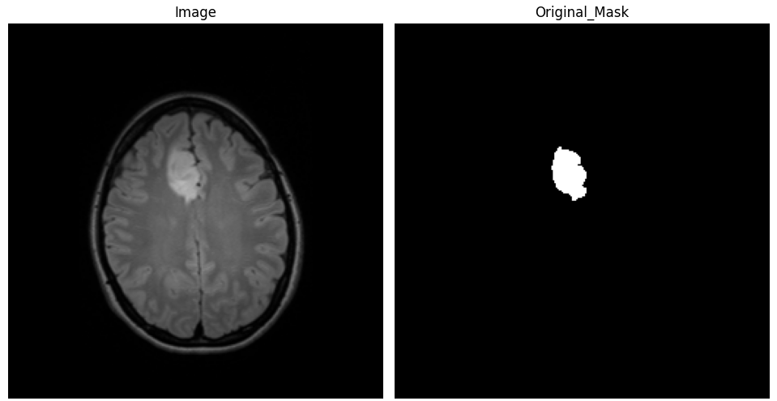
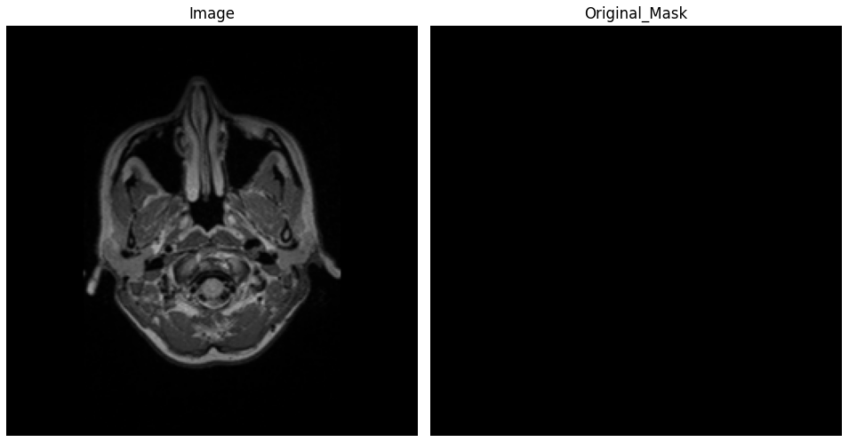
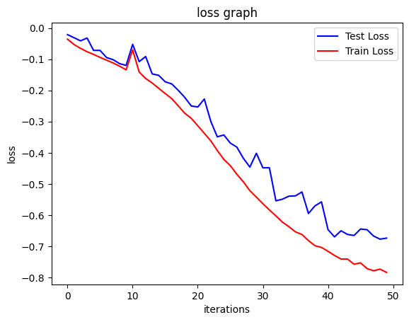
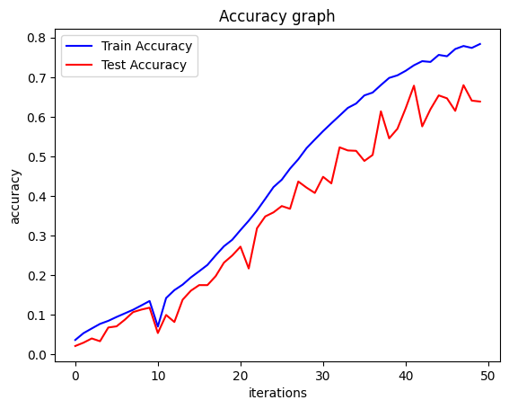
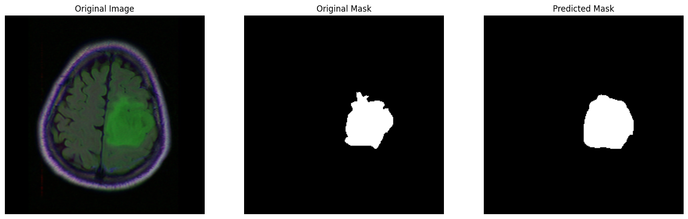
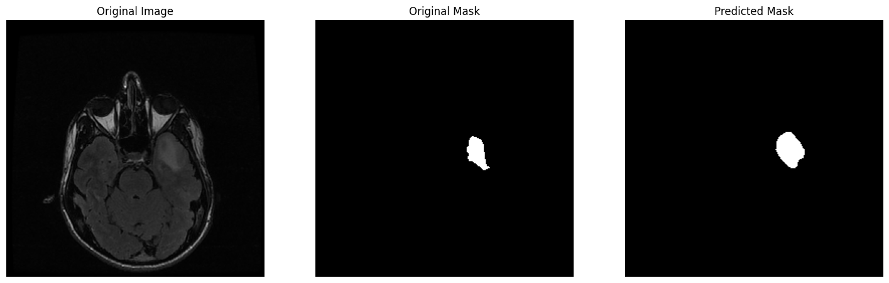
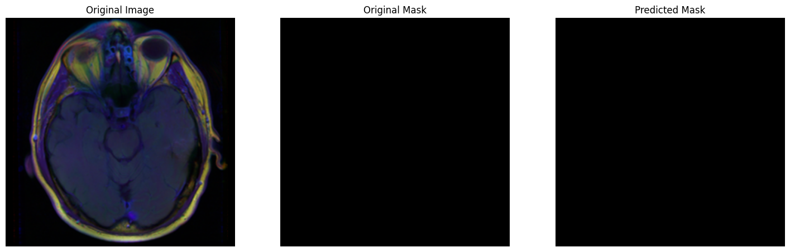

# Brain MRI Segmentation with Spatial Attention U-Net (SA-UNet)

This project focuses on the segmentation of brain MRI images using a modified U-Net architecture known as SA-UNet, which includes a Spatial Attention mechanism. The model is designed to accurately segment brain tissues, aiding in medical diagnosis and research.

## Dataset
- The dataset used in this project is the "LGG-MRI-Segmentation" dataset from Kaggle. 
- It originates from The Cancer Imaging Archive (TCIA) and is part of The Cancer Genome Atlas (TCGA) lower-grade glioma collection. 
- It features MRI images from 110 patients, specifically including fluid-attenuated inversion recovery (FLAIR) sequences and genomic cluster data. 
- The accompanying data.csv file contains detailed information about tumor genomic clusters and patient data, providing valuable context for each image in the dataset.
- Each MRI image comes with a mask that highlights regions of tumor tissue. 
- To access and explore this dataset, please visit the [LGG-MRI-Segmentation dataset on Kaggle](https://www.kaggle.com/datasets/mateuszbuda/lgg-mri-segmentation).

## Model Architecture
The SA-UNet model combines the standard U-Net architecture with a spatial attention module to enhance feature extraction and segmentation accuracy.

### Encoder Architecture
- Comprises 4 encoder blocks (conv1 to conv4).Each block contains 2 Conv2D layers, totaling 8 Conv2D layers in the encoder.
- Post each Conv2D layer, there's a sequence of DropBlock2D for regularization and BatchNormalization for standardizing inputs to the next layer.
- Each encoder block concludes with a MaxPooling2D layer, serving to downsample the spatial dimensions, thus creating a total of 4 MaxPooling layers.

### Spatial Attention (SA) Block
- Processes the final encoder output, applying both average and max pooling across channels to encapsulate channel information effectively.
- Concatenates these pooled outputs and passes them through a Conv2D layer, generating a spatial attention map.
- The attention map, normalized by a Sigmoid function, refines feature focus, enhancing significant areas while diminishing less relevant ones.
- The output feature map with applied spatial attention is then fed into the decoder.

### Decoder Architecture
- Consists of 3 decoder blocks (uconv1 to uconv3). Similar to the encoder, each block houses 2 Conv2D layers, totaling 6 in the decoder.
- These layers are accompanied by DropBlock2D, BatchNormalization, and ReLU activation, ensuring effective feature reconstruction.
- Each block begins with a Conv2DTranspose layer for upsampling, and incorporates skip connections from the encoder, enhancing detailed feature reconstruction.

This architecture ensures a comprehensive approach to segmenting MRI images, leveraging spatial attention for nuanced feature emphasis and a robust encoder-decoder structure for precise segmentation.

## Implementation
The project is implemented in Python using TensorFlow and Keras in Google Colab. The detailed implementation is available in the notebook.

### Data Preprocessing and Augmentation
The dataset is divided into three distinct sets: training (85%), validation (10%), and test (5%). This division is critical for effective model training and evaluation. A comprehensive data augmentation approach is employed to enhance the robustness of the model, which includes rotations, width and height shifts, shear, zoom, and horizontal flips. The data is also normalized to have values between 0 and 1.

### Training and Evaluation
The model is trained over 50 epochs using a batch size of 32, and the learning rate is set to 1e-4.  The SA-UNet model, shaped to process 256x256 pixel images, is optimized using the Adam optimizer. The model's performance is measured using binary accuracy, Intersection over Union (IoU), and Dice coefficient, with Dice coefficient loss as the primary loss function. A ModelCheckpoint callback is utilized to save the best model iteration during training, ensuring the retention of the most effective version of the model.

### Usage
To use this project:
- Clone the repository.
- Install the required dependencies listed in requirements.txt
- Run the Jupyter Notebook to train the model or use the pre-trained model for segmentation.
Note: The number of epochs and hyperparameters can be adjusted as per use.

## Results
The model demonstrates high accuracy in segmenting brain MRI images. The binary accuracy obtained is 99.49%, a Dice Coefficient Loss of -0.9029 suggests a high overlap between the predicted and actual masks, IoU score of 0.82, Dice Coefficient of 0.9047.

---

## 🧾 License & Attribution
- Licensed under **MIT** (see `LICENSE`).  
- Based on **suniash/brain_mri_segmentation** (MIT).

---

## 🙋 Maintainer
**Rushikesh Chnadrakant Yeola** · IIT Kharagpur (Engineering Entrepreneurship)  

> If you use or extend this work, a star ⭐ on the repo is appreciated!

